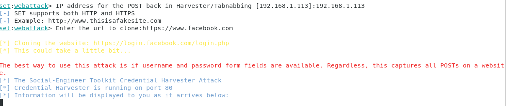

# The Social-Engineer Toolkit (SET)

> Rapport complété par Cassandre Wojciechowski
>
> Date : 25.03.2021

## Introduction

Selon la propre description donnée par [TrustedSec, LLC](https://www.trustedsec.com), la société de consulting américaine responsable du développement de ce produit, le [Social-Engineer Toolkit](https://github.com/trustedsec/social-engineer-toolkit/) est un framework de test d'intrusion open-source conçu pour l'ingénierie sociale. Le SET dispose d'un certain nombre de vecteurs d'attaque personnalisés qui vous permettent de réaliser rapidement une attaque crédible.

Le SET est spécifiquement conçu pour réaliser des attaques avancées contre l'élément humain. Il est rapidement devenu un outil standard dans l'arsenal des testeurs de pénétration. Les attaques intégrées dans la boîte à outils sont conçues pour être des attaques ciblées contre une personne ou une organisation utilisées lors d'un test de pénétration.


## Téléchargement et installation

Le SET est nativement supporté sur Linux et sur Mac OS X (experimental). Il est préinstallé sur Kali Linux et il est capable de se mettre à jour lui-même.

Pour une installation sur Ubuntu/Debian/Mac OS X :

```
git clone https://github.com/trustedsec/social-engineer-toolkit/ setoolkit/
cd setoolkit
pip3 install -r requirements.txt
python setup.py
```

## Que faut-il faire ?

Voici les activités à réalise dans ce laboratoire. Vous devez : 

- Installer le Social Engineering Toolkit (SET)
- Créer un collecteur d'identifiants (credential harvester)
- Capturer certains identifiants utilisateur (les vôtres)
- Créer une attaque de phishing
- Relier le collecteur d'identifiants à l'attaque

Le "rapport" de ce labo est très simple : **Pour chaque tâche, faites des captures d'écran de vos activités**.

## Note sur l'éthique

Il n'est absolument pas acceptable d'attaquer quelqu'un pour quelque raison que ce soit. 

L'utilisation de cet outil à des fins autres que votre propre éducation et formation sans autorisation est strictement interdite par les politiques de ce cours et de l'école, ainsi que par les lois. 

Le but de cet exercice est de vous permettre de vous familiariser avec les outils et comment ils peuvent être utilisés dans le contexte professionnel d'un pentest. Ça vous permettra aussi de comprendre les tactiques de l'adversaire afin de pouvoir les contrer par le biais de la politique, de l'éducation et de la formation.

## Execution de SET

Pour exécuter SET, dans votre terminal taper :

```
setoolkit
```

Dépendant de votre OS et de votre installation particulière, il est possible que certaines fonctionnalités ne soient pas disponibles au moins d'utiliser ```sudo```.

```
sudo setoolkit
```

# Exercice 1 - Credential Harvesting

**Vous découvrirez l'un des outils les plus couramment utilisés par les ingénieurs sociaux et les acteurs malveillants pour tromper les cibles.**

**Pour le collecteur d'identifiants, montrez que vous avez cloné un site en indiquant son adresse web et l'interface d'utilisateur. Saisissez les informations d'identification sur votre clone local, puis cliquez le bouton de connexion. Essayez plusieurs sites comme facebook.com, twitter.com, et d'autres qui puissent vous intéresser. Faites des captures d'écran des mots de passe collectés dans vos tests avec SET.**

La capture d'écran ci-dessous montre mon adresse IP pour le POST back ainsi que le site à cloner qui est `facebook`. On constate que l'outil indique ensuite que les informations envoyées depuis le site cloné apparaitront dans le terminal. 



Après avoir cloné le site, il faut se connecter sur `http://192.168.1.113:80` via le navigateur web pour obtenir la page de connexion sur le site cloné. Dessus, il faut entrer des identifiants : 


En regardant de nouveau ce qu'il se passe dans le terminal, nous constatons que les informations parviennent effectivement en temps réel : 


On retrouve ci-dessus l'adresse e-mail `imavictim@gmail.com` ainsi que le mot de passe entré dans le navigateur `victimized` dans les champs `POSSIBLE USERNAME / PASSWORD FIELD FOUND` en rouge au centre de la capture d'écran. On peut également retrouver ces informations dans le rapport généré à la fin de l'attaque : 


# Exercice 2 - Créer une attaque de phishing

**Essayez la fonction d'attaque par phishing. C'est très facile à faire. Vous pouvez vous référer à ce lien pour plus d'informations http://www.computerweekly.com/tutorial/Social-Engineer-Toolkit-SET-tutorial-for-penetration-testers**

Pour ce second exercice, nous essayons de créer un e-mail de phishing avec l'outil SET. 


Nous choisissons donc l'option `Spear-phishing attack vectors` car c'est l'objectif qui est fixé dans cet exercice. Nous indiquons vouloir effectuer une attaque en envoyant des e-mails infectés. 


22 payloads sont proposées pour effectuer cette attaque. Presque toutes les payloads présentes dans cette liste ont été testées, aucune n'a réussi à aller jusqu'au bout de l'attaque. Le même problème se déclare toujours au moment d'envoyer le mail infecté via gmail. 


En continuant le processus, nous indiquons vouloir envoyer le mail de phishing à une seule adresse mail créée pour l'occasion en utilisant un modèle pré-défini proposé par SET. Nous indiquons également vouloir passer par notre propre compte gmail pour effectuer l'attaque :


Notre adresse mail privée est entrée, ainsi que le mot de passe permettant d'y accéder, puis l'envoi du mail échoue avec l'erreur suivante : `Unable to connect to mail server. Try again (Internet issues ?)`. 

Etant donné que la connexion Internet fonctionne normalement et que le mot de passe et le compte gmail sont corrects, nous ne savons pas comment résoudre le problème. 

Malheureusement, aucune solution n'a été trouvée. Ce problème a été signalé sur Github (https://github.com/trustedsec/social-engineer-toolkit/issues/120) mais l'issue a été fermée sans apporter de réponse. 


# Exercice 3 - Explorer les liens "Phishy" et le courrier électronique "Phishy"

**Pour cette dernière partie de notre exploration du phishing, nous allons utiliser un contenu réalisé par les  Dr. Matthew L. Hale, le Dr. Robin Gandhi et la Dr. Briana B. Morrison de [Nebraska GenCyber](
http://www.nebraskagencyber.com). **

**Visitez : https://mlhale.github.io/nebraska-gencyber-modules/phishing/README/ et passez en revue les modules :**

- **Analyse d'url. Ce module risque d'être beaucoup trop simple pour vous mais il peut être très intéressant pour vos rapports de pentest, surtout comme outil pour sensibiliser les employés d'une entreprise. Gardez-le précieusement comme une partie de votre toolbox pour l'avenir.**
- **Analyse d'Email (ce module est probablement plus intéressant techniquement pour vous)**

**En général, c'est un bon exemple de matériel de formation et d'éducation qui peut aider à lutter contre les attaques de phishing et à sensibiliser le personnel d'une organisation.**

**Vous avez la liberté de reproduire et d'utiliser ce matériel grâce à sa licence.**

**Pour cette tâche, prenez des captures d'écran de :**

- **Vos inspections d'un en-tête de courrier électronique à partir de votre propre boîte de réception**

```
// E-mail reçu du Compte Communication de la HEIG-VD

Received: from EIMAIL03.einet.ad.eivd.ch (10.192.41.73) by
 EIMAIL02.einet.ad.eivd.ch (10.192.41.72) with Microsoft SMTP Server
 (version=TLS1_2, cipher=TLS_ECDHE_RSA_WITH_AES_128_GCM_SHA256) id 15.1.2176.2
 via Mailbox Transport; Fri, 5 Mar 2021 08:37:37 +0100
Received: from EIMAIL03.einet.ad.eivd.ch (10.192.41.73) by
 EIMAIL03.einet.ad.eivd.ch (10.192.41.73) with Microsoft SMTP Server
 (version=TLS1_2, cipher=TLS_ECDHE_RSA_WITH_AES_128_GCM_SHA256) id
 15.1.2176.2; Fri, 5 Mar 2021 08:36:58 +0100
Received: from EIMAIL03.einet.ad.eivd.ch ([fe80::e0be:cf4c:33e5:1dd4]) by       		 // Champ "Received from" à inspecter !
 EIMAIL03.einet.ad.eivd.ch ([fe80::e0be:cf4c:33e5:1dd4%3]) with mapi id
 15.01.2176.009; Fri, 5 Mar 2021 08:36:58 +0100
Content-Type: application/ms-tnef; name="winmail.dat"
Content-Transfer-Encoding: binary
From: Compte Communication HEIG-VD <communication@heig-vd.ch>
To: Personnel HEIG-VD <Personnel.HEIG-VD@heig-vd.ch>, Etudiants HEIG-VD
	<Etudiants.HEIG-VD@heig-vd.ch>
Subject: =?utf-8?B?UGFyY291cnMgZGUgZmVtbWVzIG1lbWJyZXMgZGUgbGEgY29tbXVuYXV0w6kg?=
 =?utf-8?Q?HEIG-VD?=
Thread-Topic: =?utf-8?B?UGFyY291cnMgZGUgZmVtbWVzIG1lbWJyZXMgZGUgbGEgY29tbXVuYXV0w6kg?=
 =?utf-8?Q?HEIG-VD?=
Thread-Index: AQHXEZJSxc8oX8QW50iasgO0eQDEOg==
X-MS-Exchange-MessageSentRepresentingType: 1
Date: Fri, 5 Mar 2021 08:36:58 +0100
Message-ID: <51074CDB-6672-4669-A85E-3DE8492A0A93@heig-vd.ch>
Accept-Language: fr-FR, fr-CH, en-US
Content-Language: fr-FR
X-MS-Has-Attach: yes
X-MS-Exchange-Organization-SCL: -1
X-MS-TNEF-Correlator: <51074CDB-6672-4669-A85E-3DE8492A0A93@heig-vd.ch>
user-agent: Microsoft-MacOutlook/10.10.1b.201012
MIME-Version: 1.0
X-MS-Exchange-Organization-MessageDirectionality: Originating
X-MS-Exchange-Organization-AuthSource: EIMAIL03.einet.ad.eivd.ch
X-MS-Exchange-Organization-AuthAs: Internal
X-MS-Exchange-Organization-AuthMechanism: 04
X-Originating-IP: [10.192.222.11]
X-MS-Exchange-Organization-Network-Message-Id: b413e8ce-db7a-4d39-4495-08d8dfa97550
Return-Path: communication@heig-vd.ch													// "Return-Path" correspondant à la HEIG
X-MS-Exchange-UserMailbox-RoutingAgent-Processed: True
X-MS-Exchange-Organization-AVStamp-Enterprise: 1.0
X-Auto-Response-Suppress: DR, OOF, AutoReply
X-MS-Exchange-Transport-EndToEndLatency: 00:00:39.6070230
X-MS-Exchange-Processed-By-BccFoldering: 15.01.2176.009
```

Nous constatons qu'il y a trois entrées `Received` en haut de l'en-tête. La première rencontrée en partant du bas de l'en-tête est l'origine de l'e-mail : `from EIMAIL03.einet.ad.eivd.ch ([fe80::e0be:cf4c:33e5:1dd4])`. On peut déduire ici que tout passe par les serveurs mail internes de la HEIG. 

Le `Return-Path` correspond bien à une adresse de la HEIG, plus précisément le compte Communication et cette entrée correspond à l'entrée `From`. 

```
// E-mail de publicité reçu de sms-gagnant.ch

Delivered-To: cassandre.wojcie@gmail.com
Received: by 2002:a17:90a:9bc7:0:0:0:0 with SMTP id b7csp2471402pjw;
        Tue, 16 Mar 2021 03:24:13 -0700 (PDT)
X-Google-Smtp-Source: ABdhPJwneME8ZgsCP8yXSaCzLrizsnLvOtfdUJkI2BXAB/UDsjAFygpyVi02hcRZubgFquuChSOa
X-Received: by 2002:a05:600c:22c7:: with SMTP id 7mr4066718wmg.85.1615890253192;
        Tue, 16 Mar 2021 03:24:13 -0700 (PDT)
ARC-Seal: [...]
ARC-Message-Signature: [...]
ARC-Authentication-Results: i=1; mx.google.com;
       dkim=pass header.i=@sms-gagnant.ch header.s=20191114 header.b=NEDC2csC;
       spf=pass (google.com: domain of webmaster@sms-gagnant.ch designates 45.157.188.20 as permitted sender) smtp.mailfrom=webmaster@sms-gagnant.ch
Return-Path: <webmaster@sms-gagnant.ch>
Received: from smtp-bc14.mail.infomaniak.ch (smtp-bc14.mail.infomaniak.ch. [45.157.188.20])					// Origine du mail
        by mx.google.com with ESMTPS id v7si16244693wrn.91.2021.03.16.03.24.12
        for <cassandre.wojcie@gmail.com>
        (version=TLS1_3 cipher=TLS_AES_256_GCM_SHA384 bits=256/256);
        Tue, 16 Mar 2021 03:24:13 -0700 (PDT)
Received-SPF: pass (google.com: domain of webmaster@sms-gagnant.ch designates 45.157.188.20 as permitted sender) client-ip=45.157.188.20;
Authentication-Results: mx.google.com;
       dkim=pass header.i=@sms-gagnant.ch header.s=20191114 header.b=NEDC2csC;
       spf=pass (google.com: domain of webmaster@sms-gagnant.ch designates 45.157.188.20 as permitted sender) smtp.mailfrom=webmaster@sms-gagnant.ch
Received: from od-622c7e.infomaniak.ch (unknown [185.181.161.62]) by smtp-3-1000.mail.infomaniak.ch (Postfix) with ESMTP id 4F08XX4Nl6zMtPck for <cassandre.wojcie@gmail.com>; Tue, 16 Mar 2021 11:24:12 +0100 (CET)
DKIM-Signature: [...]
Received: from od-622c7e.infomaniak.ch (localhost [127.0.0.1]) by od-622c7e.infomaniak.ch (8.14.5/8.14.5) with ESMTP id 12GAOCCk001157 for <cassandre.wojcie@gmail.com>; Tue, 16 Mar 2021 11:24:12 +0100
Received: (from uid26542@localhost) by od-622c7e.infomaniak.ch (8.14.5/8.14.2/Submit) id 12GAOCwA001156; Tue, 16 Mar 2021 11:24:12 +0100
X-Authentication-Warning: od-622c7e.infomaniak.ch: uid26542 set sender to webmaster@sms-gagnant.ch using -f
To: cassandre.wojcie@gmail.com
Subject: PANCAKES & BRUNCH LAUSANNE | CHF 20.- offerts
Date: Tue, 16 Mar 2021 11:24:12 +0100
From: "SMS-gagnant.ch" <contact@sms-gagnant.ch>
Message-ID: <0638ae8fb36bb97074ea4df6cc6501d6@cron.sms-gagnant.ch>
X-Priority: 3
X-Mailer: PHPMailer 5.2.7 (https://github.com/PHPMailer/PHPMailer/)
MIME-Version: 1.0
Content-Type: multipart/alternative; boundary="b1_0638ae8fb36bb97074ea4df6cc6501d6"
Content-Transfer-Encoding: 8bit
```

L'envoyeur d'origine est le domaine `od-622c7e.infomaniak.ch` et avec quelques recherches rapides, on trouve des informations sur ce domaine : 

 

On obtient l'adresse IP et la localisation des serveurs : en Ukraine. 

Le `Return-Path` est l'adresse <webmaster@sms-gagnant.ch>, qui ne correspond pas exactement au champ `From` (<contact@sms-gagnant.ch>) mais qui semble tout de même légitime. Le champ `X-Mailer` indique PHPMailer 5.2.7 et donne un lien sur le github du projet (https://github.com/PHPMailer/PHPMailer/) : "PHPMailer – A full-featured email creation and transfer class for PHP". 

En utilisant l'outil Google d'administration (https://toolbox.googleapps.com/apps/messageheader/analyzeheader) pour analyser l'en-tête de ce mail, on obtient le retour suivant : 


C'est donc une confirmation que deux serveurs Infomaniak sont impliqués avant d'arriver sur les serveurs de Google. 

Sur la capture d'écran, on constate que le mail a été livré après 1 seconde, ce qui est un bon signe. 

Par chance, avant de terminer ce rapport, un e-mail d'arnaque a été reçu : 


```
// E-mail d'arnaque

Delivered-To: cassandre.wojcie@gmail.com
Received: by 2002:a17:90a:9bc7:0:0:0:0 with SMTP id b7csp4633105pjw;
        Tue, 23 Mar 2021 08:00:45 -0700 (PDT)
X-Received: by 2002:a19:8005:: with SMTP id b5mr2958837lfd.325.1616511644981;
        Tue, 23 Mar 2021 08:00:44 -0700 (PDT)
ARC-Seal: [...]
ARC-Message-Signature: [...]
ARC-Authentication-Results: i=1; mx.google.com;
       dkim=pass header.i=@gmail.com header.s=20161025 header.b=fy8SQCyj;
       spf=pass (google.com: domain of gregmorrisoning@gmail.com designates 209.85.220.65 as permitted sender) smtp.mailfrom=gregmorrisoning@gmail.com;
       dmarc=pass (p=NONE sp=QUARANTINE dis=NONE) header.from=gmail.com
Return-Path: <gregmorrisoning@gmail.com>
Received: from mail-sor-f65.google.com (mail-sor-f65.google.com. [209.85.220.65])
        by mx.google.com with SMTPS id n7sor3842128lfu.121.2021.03.23.08.00.43
        for <cassandre.wojcie@gmail.com>
        (Google Transport Security);
        Tue, 23 Mar 2021 08:00:44 -0700 (PDT)
Received-SPF: pass (google.com: domain of gregmorrisoning@gmail.com designates 209.85.220.65 as permitted sender) client-ip=209.85.220.65;
Authentication-Results: mx.google.com;
       dkim=pass header.i=@gmail.com header.s=20161025 header.b=fy8SQCyj;
       spf=pass (google.com: domain of gregmorrisoning@gmail.com designates 209.85.220.65 as permitted sender) smtp.mailfrom=gregmorrisoning@gmail.com;
       dmarc=pass (p=NONE sp=QUARANTINE dis=NONE) header.from=gmail.com
DKIM-Signature: [...]
X-Google-DKIM-Signature: [...]
X-Gm-Message-State: AOAM531Y85Ot1EWpeZ41naKdK3HI8WQzTTyL1r8Q5c7o251ZaMmZLJpO qsEkNskaDrQvSgACvMeAWYW2Ia1n3Rt/Gs2C5Z0=
X-Google-Smtp-Source: ABdhPJwZbBEb1h3grNJawKZdJRzkfM7kF/3HZ21OhBl3M0tjmLKS1o7+zZZDcLtEciUTIVjk+TKIJ/SH1NborEI9uRA=
X-Received: by 2002:ac2:48b1:: with SMTP id u17mr2996178lfg.627.1616511643524; Tue, 23 Mar 2021 08:00:43 -0700 (PDT)
MIME-Version: 1.0
Received: by 2002:a05:6520:3815:b029:c8:4414:90bf with HTTP; Tue, 23 Mar 2021 08:00:42 -0700 (PDT)
Reply-To: usbankinfoing@gmail.com
From: "Mr.Rick Ruzzi" <gregmorrisoning@gmail.com>
Date: Tue, 23 Mar 2021 08:00:42 -0700
Message-ID: <CAEP7qYQYrbyLH0_JpW-ePHgvw=7QtmG0GqGuyaK-aLPOOj1kHQ@mail.gmail.com>
Subject: REF:- INSTRUCTION TO CREDIT YOUR ACCOUNT WITH THE SUM OF (US$5Million)
To: undisclosed-recipients:;
Content-Type: text/plain; charset="UTF-8"
Bcc: cassandre.wojcie@gmail.com
```

L'e-mail comporte un champ `from` qui est complété par le nom de Mr. Rick Ruzzi, nom qui signe également le mail, mais l'adresse e-mail de l'envoyeur est celle de gregmorrisoning@gmail.com. Le `Return-Path` indique bien cette adresse en cas d'e-mail non-livré. Par contre, le champ `Reply to` ne correspond pas à l'adresse de l'envoyeur. Les champs `X-mailer` et `X-Distribution` ne sont pas inclus dans l'en-tête et ne sont donc pas vérifiables. 

Le dernier champ inclut dans l'en-tête est `Bcc`, dans l'article indiqué comme référence au début de cet exercice, il est mentionné que si ce champ est présent, c'est le signe que l'e-mail a été mal réalisé car cet en-tête ne figure pas dans les e-mails normaux.  

Les informations de contact fournies en début de mail sont les suivantes : 

```
Us Bank.1025 Connecticut Ave.
NW, Ste. 510. Washington, DC 20036.
Tell: (213) 537-2170
E-mail: usbankinfoing@gmail.com
```

Mais quand on géolocalise l'adresse IP 209.85.220.65, on constate qu'elle est basée en Californie : 


Nous déduisons donc que la personne n'est pas qui elle prétend être. 
